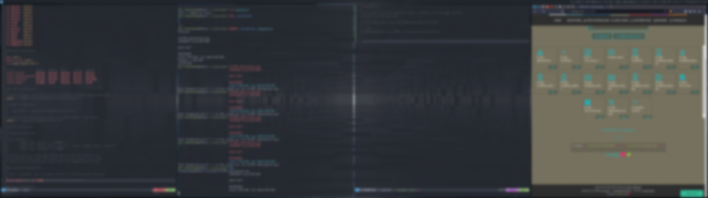

# swaylock.sh

This script is used with swaylock to take a screenshot, blur the image, and then
display it as the lockscreen.



To use, bind a key in your sway config that calls this script.

```text
bindsym $mod+Ctrl+l exec $HOME/.config/sway/scripts/swaylock.sh
```
